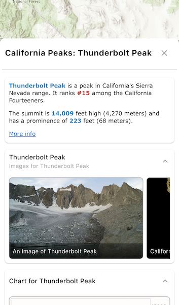

# PopupView

The `PopupView` displays a feature popup with its various popup elements. This includes showing the feature's title, attributes, custom description, media, and attachments. The popup elements are configured externally (using either the Web Map Viewer or the Field Maps web app).



## Usage

A popup is usually obtained from an identify result:

```dart
final result = await _mapViewController.identifyLayer(
  featureLayer,
  screenPoint: clickedScreenLocation,
  tolerance: 20,
  returnPopupsOnly: true,
);
if (result.popups.isNotEmpty) {
  final popup = result.popups.first;
  // ...
}
```

Then a `PopupView` can be created to wrap the popup and display its contents in a sized widget, such as a Dialog or a Container:

```dart
PopupView(
  popup: popup,
  onClose: () {
    // Optional: handle close action
  },
)
```

The `onClose` parameter is an optional callback for closing the `PopupView`. By default, it simply closes the view.